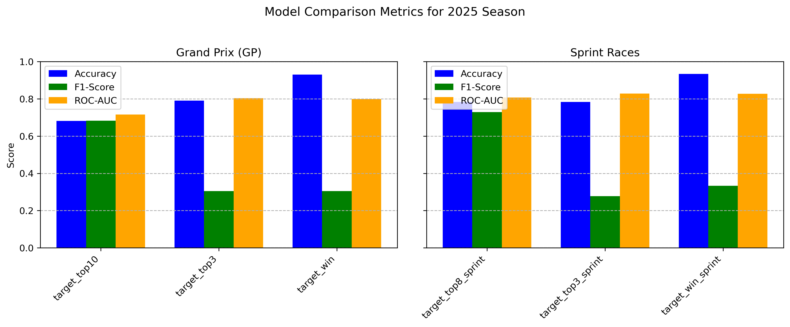
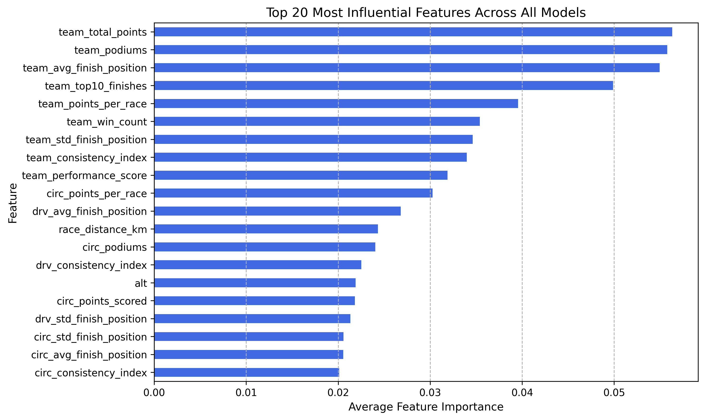
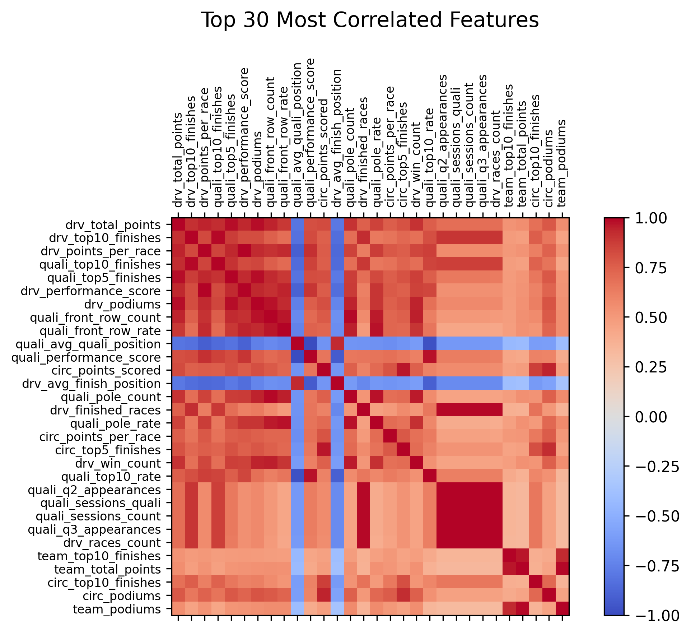
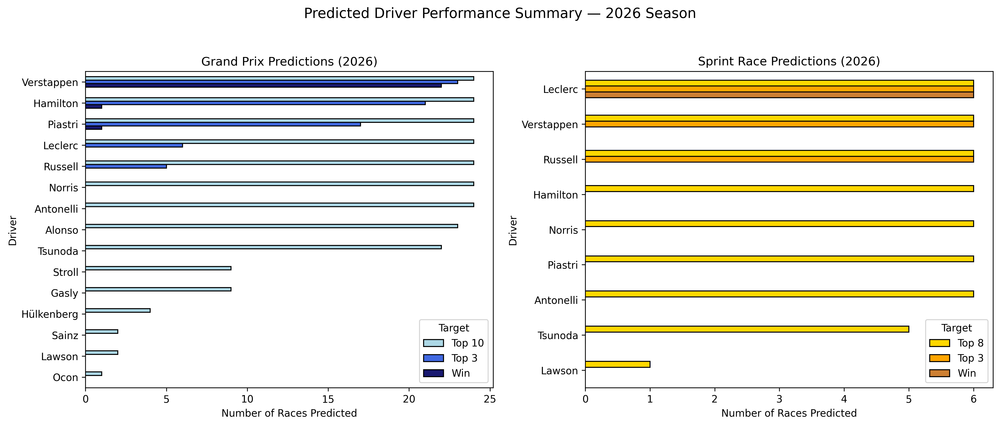

# Predicting Formula 1 Race Outcomes (Season‑Ahead Forecasting)

*Abstract*-This project explores the use of machine learning to analyze and predict Formula 1 race outcomes using historical performance data. Random Forest models were trained on features to forecast key results such as top-10, top-8, podium, and race wins across both Grand Prix and Sprint events. Our approach combines predictive modeling with analytical visualization to better understand which factors most strongly influence success. Results highlight the strong influence of team, circuit, and driver performance, with Random Forest achieving solid validation scores that confirm both reliability and interpretability.
Overall, the project offers an interpretable view of performance trends in Formula 1. These findings could support team strategy, season planning, and even enhance the experience for F1 fans.

## I. INTRODUCTION
Formula 1 has always been a sport of precision, strategy, and constant innovation. Each race combines driver skill, car engineering, and tactical choices made under intense pressure, all within environments that change from one circuit to another, making outcome prediction a complex task. As the sport becomes increasingly data-driven, engineers are constantly seeking methods to analyze and interpret the growing volume of historical race information in order to improve both car and driver performance over time.

Machine learning provides a promising framework to uncover key factors influencing success and performance trends within these complex datasets. Beyond the excitement of competition, understanding what drives success on the track is also a way to study human performance, decision-making, and technological optimization under pressure.

## II. Research Question

### A. Problem
Predicting performance in Formula 1 is a complex challenge. Race results depend on a mix of factors such as driver ability, car performance, team strategy, and race conditions like track type or weather. No single element determines success, and small differences in performance can completely change race outcomes.

Another layer of complexity comes from the financial structure of the sport. Since 2021, Formula 1 has introduced a budget cap, limiting how much teams can spend each season. However, not all teams operate at the spending limit, as some lack the financial resources to reach it, which naturally creates unequal conditions across the grid. This imbalance contributes to performance gaps that are difficult to quantify using traditional analytical methods.

These challenges make Formula 1 an ideal field for applying machine learning, which can account for multiple interacting variables and uncover relationships that are not immediately visible through classical statistics. Understanding how these technical, strategic, and human factors interact to shape race outcomes lies at the core of this project’s research question:

**Can machine learning models predict future Formula 1 race outcomes using historical performance data and contextual features such as driver consistency, team performance, and circuit characteristics?**

### B. Objective
The main goal of this project is to leverage machine learning techniques to predict Formula 1 race outcomes for both Grand Prix and Sprint races. Specifically, the models aim to forecast whether a driver will finish within the top-10, top-3, or Win a Grand Prix, and within the top-8, top-3, or Win a Sprint race. These thresholds align with the FIA’s official points-scoring positions and provide a structured way to evaluate model performance across varying levels of competitiveness.

Machine learning classifiers were trained using data from the five most recent seasons preceding the target year. For the current project, this means that models predicting the 2026 season use data from 2021 to 2025. This rolling-window approach enables the models to learn from the latest performance dynamics while avoiding information leakage from future results. Separate models are built for Grand Prix and Sprint formats to capture their distinct race lengths, strategies, and point systems.

The project’s objectives extend beyond accurate prediction. By analyzing feature importances, it seeks to identify key performance drivers such as team trends, driver consistency, and circuit characteristics and visualize them for interpretability.

### C. Scope
The scope of this project is defined by both its analytical depth and its temporal focus. The analysis covers Formula 1 race data from 2015 to 2025. This range ensures sufficient historical depth to capture evolving performance trends while maintaining relevance to the modern hybrid era of Formula 1.

The models are trained using a rolling five-year window as described previously. This setup allows the models to continuously adapt to new conditions and driver-team combinations, reflecting the sport’s dynamic nature.

A key design choice in this project is the automation of the entire workflow. Data preparation, feature engineering, model training, evaluation, and visualization steps are largely automated to dynamically adjust based on the chosen data range. This means that the same pipeline can be reused for future seasons without structural changes, the user only needs to specify the filtering period (e.g., 2015–2025). This design ensures both flexibility and long-term applicability.

## III. Methodology
This section outlines the methodology used to develop and evaluate the Formula 1 race prediction pipeline, covering the dataset, preprocessing, feature engineering, model selection, and performance evaluation. The objective was to build a fully reproducible workflow capable of generating accurate and interpretable predictions of race outcomes.

### A. Dataset Description
The dataset used in this project is based on historical Formula 1 data spanning the 1950–2025 seasons. However, the analysis focuses on the 2015–2025 period to align with the modern hybrid era of the sport and ensure consistency in performance dynamics.
The data originates from the **"Formula 1 Race Data" repository available on Kaggle**, which itself builds upon the official **Ergast API**, a continuously updated and reliable source providing structured race results, standings, and metadata for every Formula 1 event. Using this dataset ensures consistency with official FIA statistics, while offering a clean, machine-learning-ready structure. Data downloading and management are handled through the src/downloading_dataset.py file, ensuring reproducibility and uniform access across runs.

The dataset is organized in a **relational structure** where each CSV file represents a distinct table (e.g., drivers.csv, constructors.csv, races.csv, results.csv, and circuits.csv). These tables are interconnected through primary and foreign keys such as driverId, constructorId, raceId and circuitId, allowing efficient merging and cross-referencing of entities across the dataset.

At the core of this structure is the races.csv table, which links race results to circuits, seasons (years), and numerous other features. This relational architecture enables the creation of integrated datasets that combine driver-level, team-level, and circuit-level attributes for each race which forms the analytical foundation of this project.

### B. Preprocessing Steps
The preprocessing phase was a crucial component of this project, transforming raw Formula 1 data into a consistent, enriched, and model-ready format. All the data preparation logic was implemented in the src/data_loader.py, src/data_enrichment.py, and src/features.py scripts, ensuring a modular and reproducible workflow.

The process began by **filtering the raw datasets** to include only the **2015–2025 seasons**, corresponding to the modern hybrid era of Formula 1. This period was selected to ensure consistency in technical regulations and competitive structure. The filtering leveraged the relational structure of the dataset, with races.csv serving as the central reference to link data across multiple tables such as drivers.csv, constructors.csv, results.csv, and circuits.csv. Cleaned datasets were stored in the data/processed/ directory, while the original Kaggle/Ergast files were preserved in data/raw/ for full traceability.

After cleaning and standardizing the data, several datasets were enriched with newly engineered features designed to capture additional contextual and performance-related insights. For instance, the circuits file was completed with variables such as length_km (total track length in kilometers), is_night_race (boolean variable identifying night races), and track_type (circuit classification: high_speed, technical, balanced). From these attributes, the total race distance (race_distance_km) was derived for each Grand Prix. Similarly, the status table, which originally listed detailed incident causes, was reworked into four categories (is_mechanical, is_crash, is_other_dnf, is_no_dnf) to enable the calculation of driver and constructor reliability metrics.

To avoid data leakage and capture evolving trends, a series of progressive performance tables were created for each entity including drivers, constructors, qualifying sessions, sprints, and driver–circuit combinations. Each table aggregated historical statistics such as average finish position, podium rate, mechanical failure rate, and consistency indices.
In addition, measures of driver and constructor experience were incorporated, allowing the model to learn from recent yet contextually relevant performance patterns rather than entire career histories.

The final step consisted of **merging all progressive performance tables** into a single integrated table named model_dataset.csv serving as the foundation for model training. This dataset, generated through the features.py file, contains **2,278 rows and 113 columns**, representing a rich overview of the features influencing race outcomes in Formula 1.
A **rolling five-year window** was applied. This setup keeps the model consistent over time and adaptive to new data, while avoiding any leakage from future results.

### C. Models Used
The predictive modeling stage of this project focused on evaluating multiple machine learning algorithms to identify the most effective approach for forecasting Formula 1 race outcomes. The model development and training logic were implemented in the src/models.py file, ensuring full reproducibility and consistency across experiments.

Several models including Logistic Regression, Gradient Boosting, XGBoost, and Random Forest were tested and compared. Logistic Regression served as a simple, interpretable baseline but struggled to capture the nonlinear patterns present in racing data. Gradient Boosting and XGBoost, both ensemble methods that build trees sequentially, achieved strong accuracy but required extensive parameter tuning and were more prone to overfitting on this project’s relatively small dataset (about 2,000 rows). In contrast, Random Forest, which trains multiple trees in parallel and averages their outputs, produced the most stable and interpretable results by reducing random variance across predictions. Random Forest was therefore retained as the final predictive model.

| Model                | Validation Accuracy | Validation ROC–AUC |
|----------------------|---------------------|--------------------|
| Logistic Regression  | 0.726514            | 0.738023           |
| Random Forest        | 0.797495            | 0.834467           |
| Gradient Boosting    | 0.751566            | 0.803060           |
| XGBoost              | 0.764092            | 0.808159           |

The final Random Forest classifier was configured with the following hyperparameters: 
- **n_estimators = 700** (number of trees in the ensemble) 
- **max_depth = 20** (limits tree depth to avoid overfitting) 
- **min_samples_split = 2** and **min_samples_leaf = 3** (controls node splitting for smoother 
  decision boundaries)
- **max_features = "sqrt"** (enables random feature selection to decorrelate trees) 
- **bootstrap = True** (applies bootstrapped sampling for robust ensemble learning) 
- **class_weight = "balanced"** (compensates for class imbalance in race outcomes) 
- **random_state = 42** (ensures reproducibility of results) 
- **n_jobs = -1** (leverages all available CPU cores for parallel training and faster computation) 

### D. Evaluation Metrics
Model performance was evaluated using complementary metrics designed to assess both overall accuracy and class-specific quality. The evaluation process, implemented in src/evaluation.py, produced detailed reports and visualizations stored in the results/ directory.

**Accuracy** served as the primary metric, representing the proportion of correctly predicted outcomes. However, since Formula 1 results are highly imbalanced (only one driver wins out of twenty), additional metrics were included to provide a more balanced evaluation. The **F1-score** was used to capture the balance between precision and recall for rare events such as wins or podium finishes, while **ROC–AUC** measured the model’s ability to distinguish between positive and negative classes across different thresholds.

Evaluations covered all predictions targets (Top-10, Top-8, Top-3, Win) across both formats. This multi-target analysis provided a comprehensive view of model robustness and predictive reliability. Final results and comparative plots were generated using the src/visualization.py module, offering a clear overview of model performance across all targets and evaluation metrics.

#### Directory Structure

Final-Project-Formula1/
│
├── data/
│ ├── processed/
│ └── raw/
│
├── notebooks/
│
├── results/
│ ├── graphs/
│ ├── comparisons_predictions_2025.csv
│ ├── predictions_2025.csv
│ ├── predictions_2026.csv
│ └── rf_baseline_metrics.csv
│
├── src/
│ ├── init.py
│ ├── downloading_dataset.py
│ ├── data_loader.py
│ ├── data_enrichment.py
│ ├── features.py
│ ├── models.py
│ ├── evaluation.py
│ └── visualization.py
│
├── main.py
├── project_report.md
├── PROPOSAL.md
├── README.md
├── environment.yml
├── requirements.txt
└── .gitignore

## IV. Results
This section presents and interprets the main results obtained from the Random Forest models used to predict Formula 1 race outcomes.

### Model Comparison Table
To assess predictive robustness, several Random Forest models were trained and evaluated across multiple targets. The table below summarizes their respective training, validation, and testing periods, along with the resulting performance metrics:

| Target             | Train Years      | Val Years | Test Years | Test Accuracy | Test ROC–AUC | Race Type 
| ------------------ | ---------------- | --------- | ---------- | ------------- | ------------ | --------- |
| target_top10       | 2021, 2022, 2023 | 2024      | 2025       | 0.7223        | 0.7166       | gp        |
| target_top3        | 2021, 2022, 2023 | 2024      | 2025       | 0.8079        | 0.8042       | gp        |
| target_win         | 2021, 2022, 2023 | 2024      | 2025       | 0.9332        | 0.8103       | gp        |
| target_top8_sprint | 2021, 2022, 2023 | 2024      | 2025       | 0.7833        | 0.8067       | sprint    |
| target_top3_sprint | 2021, 2022, 2023 | 2024      | 2025       | 0.7917        | 0.8301       | sprint    |
| target_win_sprint  | 2021, 2022, 2023 | 2024      | 2025       | 0.9583        | 0.8304       | sprint    |
> Source: results/rf_baseline_metrics.csv 
> (To get the graph, see results/graphs/rf_model_performance_by_target.png) 

The models achieved **strong predictive performance** across all targets, with consistent ROC-AUC values. The slightly higher accuracies observed in Sprint predictions likely reflect the shorter race duration and reduced number of laps, which limit external variability factors such as tire degradation or pit-stop quality.

### Performance Visualization
To better illustrate the model’s behavior across different prediction targets, the following figure compares the **Accuracy**, **F1-score**, and **ROC–AUC** metrics for both race formats.  
This visual representation helps identify how well the model generalizes across targets ranging from broader categories (Top-10 / Top-8) to specific outcomes (Top-3, Win):

Interestingly, the model achieves high Accuracy and ROC–AUC values even for rare targets such as race wins, which might seem counterintuitive at first glance. This can be explained by the dominance of a few top-performing drivers and teams, their consistent results make these outcomes easier to classify correctly. However, the lower F1-scores for these categories reveal that, while the model recognizes dominant patterns, it remains less effective at identifying occasional upsets or less frequent podium finishes.

### Feature Importance and Correlation
To gain deeper insight into how the model makes its predictions, we analyzed both the feature importances extracted from the Random Forest and the correlations between key variables. These analyses help identify which factors most strongly influence race outcomes and how they interact.
The figure below presents the 20 most influential features identified across all Random Forest models:

The ranking reveals that team- and circuit-level metrics play a dominant role in determining race outcomes, reflecting the impact of car performance, team consistency, and track characteristics. Driver-related indicators also contribute meaningfully, highlighting the balance between individual performance and collective team dynamics in modern Formula 1.
This observation also ties back to Section II.A (Problem), which noted how financial disparities still exist despite the budget cap. The stronger influence of team-level features suggests that car performance and how efficiently each team uses its resources, remains a slightly bigger factor than driver ability. In other words, the feature importance results reflect what we see in the real world of Formula 1: success often relies a bit more on engineering excellence and car performance than on pure driving skill.

To complement this section, the heatmap below visualizes the 30 most correlated features among the main variables used in the model. It highlights how some groups of features move together, while most relationships remain moderate overall.

The dark red block in the lower-right corner stands out as the main cluster, mostly driven by qualifying-related variables. Metrics like sessions count and Q2 appearances are tightly linked since they describe similar aspects of single-lap performance. This strong correlation makes sense, qualifying results often capture both the car’s pace and the driver’s precision, which together tend to predict how competitive a team will be on race day.

### Predicted Driver Performance and Championship Outlook
To conclude the analysis, the final Random Forest model generated predictions for the upcoming 2026 Formula 1 season, covering both Grand Prix and Sprint formats.
The figure below summarizes the predicted performance of each driver across all circuits:

In Grand Prix races, Verstappen is expected to dominate ahead of Hamilton, Piastri, and Leclerc, confirming his edge over full-distance events. In contrast, Sprint predictions show Leclerc leading narrowly over Verstappen, reflecting Ferrari’s stronger performance in shorter formats.
Overall, the model highlights two distinct tiers: Verstappen, Hamilton, Leclerc, and Piastri form the leading group, while Russell, Norris, and Antonelli make up a competitive midfield. Combining both formats, **the projected Drivers’ Championship podium for 2026 places Verstappen ahead of Hamilton and Leclerc, with Piastri and Russell close behind.**

A more detailed version of these predictions, showing per-driver and per-circuit outcomes, can be found in the graphs/ folder under predictions_heatmaps_2026.png.

## V. Discussion
The Random Forest model outperformed other algorithms, thanks to its capacity to capture non-linear relationships between driver, team, and circuit factors.

The analysis showed that team- and circuit-level features had a stronger influence on race outcomes than driver-only metrics. This reflects current Formula 1 dynamics, where car performance and reliability often outweigh individual skill. The model’s predictions therefore aligned closely with real-world performance patterns.

Despite its strong predictive performance, **the model still faces important limitations.** Even though reliability metrics such as historical frequencies of crashes or mechanical failures were included to estimate race incident likelihood, these cannot fully capture Formula 1’s inherent unpredictability driven by weather or incidents.

Moreover, Formula 1 performance is also influenced by human and psychological factors that data alone cannot capture, such as driver confidence, focus, or team decision-making under pressure. These aspects often weigh as heavily as mechanical performance or race strategy but remain invisible to the model.

Finally, predictive reliability depends on the completeness and quality of the data. Factors like tire strategy, mid-season upgrades, or real-time pit-stop decisions are not modeled explicitly, introducing uncertainty. These limitations highlight that, while the model provides valuable insights, it cannot fully capture the dynamic and multifaceted nature of Formula 1 competition.

Overall, the results aligned with expectations: dominant drivers and teams were correctly identified, and Sprint predictions showed greater uncertainty, as expected given their more unpredictable format. These findings confirm that data-driven models can effectively capture the structural dynamics of Formula 1 while still respecting the sport’s inherent variability.

## Conclusion
This project applied machine learning techniques to predict Formula 1 race outcomes using historical performance data. After testing multiple algorithms, Random Forest emerged as the most reliable and interpretable.

In response to the project’s central question from Section II.A (Problem), the results show that machine learning can predict Formula 1 outcomes from historical and contextual data, though these findings should be interpreted with some caution.

Future work could include real-time variables such as tire wear, pit-stop strategy, or weather conditions to enhance predictive accuracy. While uncertainty remains part of the sport, this project demonstrates that data-driven modeling can reveal valuable insights into performance trends and competitive balance in modern motorsport.

# References
Datasets and Data Sources: 
- Kaggle: Formula 1 Race Data - dataset compiling official Formula 1 results and metadata, built using the
  Ergast API. (https://www.kaggle.com/datasets/jtrotman/formula-1-race-data)
- Ergast Developer API: official open API providing structured Formula 1 historical data since 1950. 

Libraries and Frameworks: 
- A complete list of dependencies can be found in the requirements.txt file 
- For further details regarding exact package versions, please refer to the environment.yml file 

Tools and External Resources: 
In addition to the datasets and libraries mentioned above, several online tools and resources were used to  support the development, debugging, and validation of the project.
- Formula 1 Official Website 
- L’Équipe – F1 Section 
- GitHub Copilot on Nuvolos 